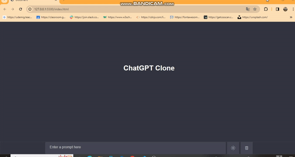

<h1> ChatGpt-Clone-Project</h1>

This project encompasses a ChatGPT clone developed based on OpenAI's GPT-3.5 architecture. ChatGPT is an artificial intelligence model that interacts with users in natural language through its natural language processing capabilities.

<h2> Features </h2>

- Advanced Chat Interface: Users can interact with the ChatGPT clone via a text input box on a web page.
- *Beautiful Theme Options: Users can switch the interface theme between light and dark modes.
- Data Storage: The chat content is stored using browser local storage, allowing users to view their chat history even when they reload the page.
- ChatGPT API Integration: User-inputted text is processed using the OpenAI GPT-3.5 API, and the response from ChatGPT is displayed back to the user.

<h2> Technologies Used </h2>

- HTML, CSS, and JavaScript: Fundamental web technologies
- OpenAI GPT-3.5 API: Artificial intelligence service used for natural language processing capabilities

<h2> How to Use </h2>

1. Type a message into the text input box.
2. Click the "Send" button or press Enter to submit your message.
3. Observe the response from ChatGPT and a typing animation.

<h2> Screenshots </h2>

